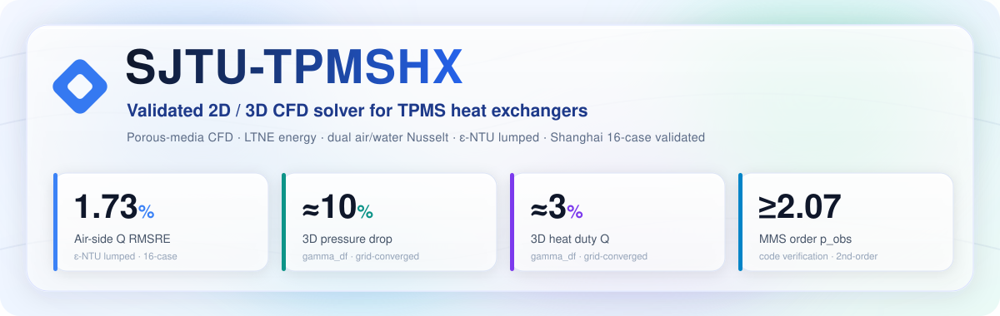

<div align="center">

<picture>
  <source media="(prefers-color-scheme: dark)" srcset="assets/hero-dark.svg">
  <source media="(prefers-color-scheme: light)" srcset="assets/hero-light.svg">
  
</picture>

<br><br>


🔗 **[github.com/alexlu997/SJTU-TPMSHX](https://github.com/alexlu997/SJTU-TPMSHX)**

</div>

> [!IMPORTANT]
> Research / dissertation code — APIs evolve and rough edges are expected.
> Porous-media CFD with LTNE energy, dual air/water Nusselt closures, and an
> ε-NTU lumped solver, benchmarked against the **Shanghai 16-case** experimental dataset.

---

## 🚀 Headline results

<div align="center">

| Metric | Value | Where |
|:------:|:-----:|:------|
| **Air-side Q** RMSRE | **1.71 %** | ε-NTU lumped dual-Nu, Shanghai 16-case |
| **3D pressure drop** RMSRE | **≈ 12 %** | full SIMPLE 3D, gamma_df default, grid-converged (all-axis Richardson) |
| **3D heat duty Q** RMSRE | **≈ 3 %** | full SIMPLE 3D, gamma_df default, grid-converged |
| **MMS** observed order `p_obs` | **1.975** | code verification, SOU 2nd-order |

</div>

> [!NOTE]
> The **grid-converged** 3D Δp RMSRE vs the Shanghai cases is **≈ 12 %** (all-axis Richardson) —
> a **geometry / closure floor**: SLM roughness is already embedded in the experiment-trained
> Darcy–Forchheimer closure, so no extra friction multiplier (that would double-count). Two
> things shape the *finite-grid* value: a **mass-flux** air-inlet BC (removes a compressible
> velocity-inlet artifact) and a **2nd-order face-extrapolated** Δp reduction
> (`extract_dP_face_extrap`, which removes the cell-centre O(h) half-cell offset and accelerates
> convergence). At the production grid (`Nz=10`) the face-extracted Δp reads ≈ 7 %, but that is
> under-resolved — refining all three axes the Δp RMSRE rises to the ≈ 12 % floor, and the
> cell-centre and face reducers converge to the same continuous-PDE Δp. **Q** is a duty integral,
> independent of the Δp reduction, clean 2nd-order and grid-converged at **≈ 3 %**. Δp functional
> order is verified in `tests/test_dp_face_extrap_order.py`, direction-invariance (any ±x/±y/±z
> flow axis) in `tests/test_dp_direction_invariance.py`.

---

## 🧩 What it does

| Layer | Capability |
|-------|------------|
| **Geometry** | Diamond + Gyroid TPMS sheet HX, parameterised by cell size `a` and wall thickness `t` |
| **Closures** | Darcy–Forchheimer surrogate (RBF over CFD micro-runs) · dual Nusselt: **air-side** v4.1 (×1.28 roughness-calibrated) / **water-side** Yan 2024 |
| **2D solver** | SIMPLE (Patankar), ideal-gas air, Brinkman–Forchheimer porous core |
| **3D solver** | full SIMPLE 3D **+** Streamfunction–Pressure formulation with a 3D Pressure-Poisson solve (Helmholtz machine-ε mass conservation) · **mass-flux inlet** (ideal-gas) by default |
| **Lumped** | ε-NTU dual-Nu cross-flow — `validate_shanghai_lumped_dual_nu.py` |
| **Validation** | Shanghai 16-case — Q air RMSRE **1.71 %** (lumped) · 3D Δp **≈12 %** / Q **≈3 %** (gamma_df, grid-converged) · 2D Δp **≈ 28 %** |
| **V&V** | ASME V&V 20 Standard Tier — MMS code verification (`p_obs ≈ 1.97`), GCI grid convergence, tolerance sweep |
| **GUI** | PySide6 + pyvistaqt 3D viewer · 3-workspace session persistence · glassmorphism dark theme |

---

## ⚙️ Install

> Tested on **Python 3.11 / 3.12, Windows 11**. Linux should work; macOS untested.

```bash
git clone https://github.com/alexlu997/SJTU-TPMSHX.git
cd SJTU-TPMSHX

python -m venv .venv
.venv\Scripts\activate          # PowerShell
# source .venv/bin/activate     # bash

pip install -r requirements.txt
```

GPU PyTorch is **optional** — only needed to re-train the Darcy–Forchheimer surrogate.
The runtime path loads an exported joblib RBF model.

---

## ▶️ Run

> [!TIP]
> New here? Launch the **GUI** to explore geometry + solvers interactively, then
> reproduce the paper numbers headless with the **validation** scripts below.

#### 🖥️ GUI

```bash
python -m sjtu_tpmshx.main
```

#### 🧪 Headless validation — Shanghai 16-case

```bash
# Lumped ε-NTU dual-Nu — current paper baseline
python sjtu_tpmshx/validation/cases/validate_shanghai_lumped_dual_nu.py

# 3D real solver (SIMPLE, Nz=10, mass-flux inlet)
python sjtu_tpmshx/validation/cases/validate_shanghai_3d_real.py
```

#### ✔️ Tests

```bash
pytest sjtu_tpmshx/tests/ -v        # 67 test files
```

---

## 🗂️ Repo layout

```text
SJTU-TPMSHX/                   # repo root
├── sjtu_tpmshx/               # Python package
│   ├── solvers/               # SIMPLE 2D/3D, LTNE, tpms_calc, roughness, envelope
│   ├── pipelines/             # stages_2d / stages_3d (+ stages_3d_helpers)
│   ├── df_surrogate/          # Darcy–Forchheimer surrogate (gamma_df / rbf)
│   ├── controllers/           # Qt: ComputeOrchestrator, ResultCache, pipelines
│   ├── core/ domain/ configs/ # Qt-free evaluators / validators / canonical case JSON
│   ├── optimization/          # qNEHVI multi-objective Pareto
│   ├── design/                # quick multi-case TPMS sizing tool
│   ├── ui/                    # PySide6 widgets, themes, ui_builders
│   ├── assets/logos/          # branding images (gitignored png)
│   ├── runs/                  # orchestration: production entry-points + helpers + golden gate
│   │   ├── demos/ diagnostics/ smokes/ tools/   # scripts grouped by role
│   │   └── archive/ cfd_asym/ _out/
│   ├── validation/            # V&V — result CSVs + status docs at this root
│   │   ├── harness/           # reusable test infra (_harness, _metrics, _case_sets, …)
│   │   └── cases/             # runners (Shanghai, MMS, GCI, conservation audits)
│   ├── tests/                 # pytest suite
│   └── main.py                # GUI entrypoint
├── projects/                  # collaboration deliverables (624-Retrodict / 703-sCO2-D76 / 704-Aircooler-10kW)
├── openspec/                  # spec-driven change proposals + capability specs
└── reports/ opt_runs/ poc/ benchmarks/   # computed outputs / PoC / perf benchmarks
```

Research notes & experiment reports live in **[`vault/`](vault/)** — organised into
`method/`, `validation/`, and `engineering/` buckets (plus `_deferred/`, `_archive/`).
See `vault/reports/README.md` for the index.

---

## ✅ V&V

ASME V&V 20 **Standard Tier** complete (single-day closure, 2026-05-04):

| Phase | Result |
|-------|--------|
| **A — MMS code verification** | A.1–A.4, 5-grid h-refinement, `p_obs ≥ 2.07` (gate ≥ 1.5) |
| **B — Grid convergence (GCI)** | T2 **0.86 %**, T4 `H=8` grid-30 **1.37 %** |
| **C — Tolerance / iteration sweep** | spread **0.02 %** |
| **D — Domain sweep** | **18 / 20** PASS, applicability `u ≤ 10 m/s` |
| **E — Validation vs experiment** | Shanghai lumped Q RMSRE **1.71 %** |

Streamfunction–Pressure formulation: 3D PPE Phase-A MMS `p_obs = 1.975` (SOU 2nd-order verified).

---

## 📖 Cite

If you use this code, please cite the dissertation (in preparation). Provisional BibTeX:

```bibtex
@misc{lu_sjtu_tpmshx_2026,
  author = {Lu, Alex},
  title  = {SJTU-TPMSHX: a Validated Solver for TPMS Heat Exchangers},
  year   = {2026},
  url    = {https://github.com/alexlu997/SJTU-TPMSHX},
}
```

---

## 📜 License

**MIT** — see [LICENSE](LICENSE).

<div align="center">
<sub>Research / dissertation code · APIs evolve, expect rough edges · contributions & issues welcome</sub>
</div>
